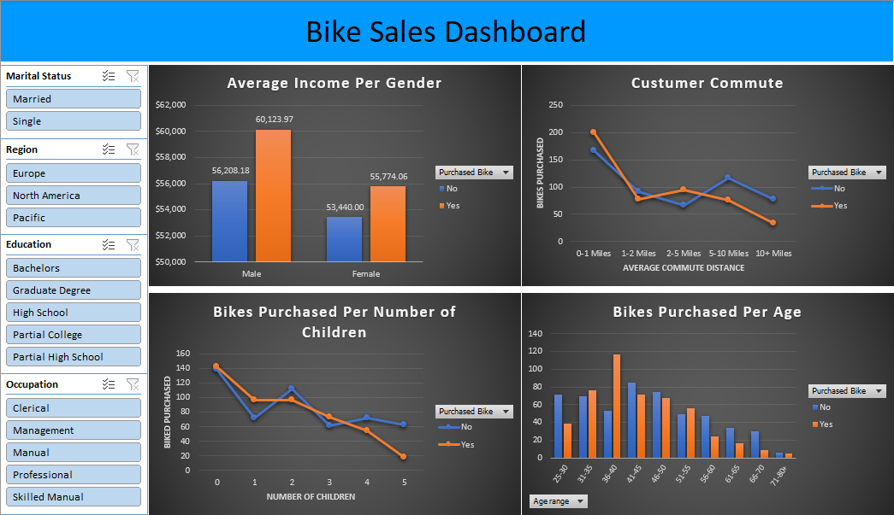

# Purchased Bikes Excel Project 

The aim of the project was to expand the analisis of the tutorial project made by [Alex The Analist](https://www.youtube.com/watch?v=opJgMj1IUrc&list=PLUaB-1hjhk8FE_XZ87vPPSfHqb6OcM0cF&index=28) and gain insights about bike sales using Excel.

The dataset was obtained from [Alex The Analist's Tutorial](https://github.com/AlexTheAnalyst/Excel-Tutorial/blob/main/Excel%20Project%20Dataset.xlsx) and contains 13 columns with the following information:

- "ID": a unique identifier for each customer
- "Marital Status": the marital status of the customer, either "M" for Married or "S" for Single
- "Gender": the gender of the customer, either "M" for Male or "F" for Female
- "Income": the annual income of the customer in USD
- "Children": the number of children the customer has
- "Education": the highest level of education the customer has completed, either "High School", "Bachelors", "Graduate degrre", "High school", "Partial High school" or "Partial College"
- "Occupation": the occupation of the customer, either "Professional", "Skilled Manual", "Clerical", "Manual" or "Management"
- "Home Owner": whether or not the customer owns a home, either "Yes" or "No"
- "Cars": the number of cars the customer owns
- "Commute Distance": the distance the customer commutes to work in miles
- "Age": the age of the customer
- "Purchased Bike": whether or not the customer purchased a bike, either "Yes" or "No"

## Implementation Details
The following steps were taken in the project:

-Removed all the duplicate rows to ensure the data is clean and free of errors.

-Modified the values of the columns "Marital Status" and "Gender" by changing "M/S" into "Married/Single" and "M/F" into "Male/Female" to make them more explicative.

-Created some age categories using nested IF function of Excel.

-Created four pivot tables to analyze the data:

- "Average Income Per Gender"

- "Customer Commute"

- "Bikes Purchased Per Age"

- "Bikes Purchased Per Number of Children"
        
The target variable was always the count of "Purchased Bike", except on the first pivot table where it was the average income with "Purchased Bike" being the legend.
    
-Created a dashboard with charts created from the pivot tables.
    
-Added four slicers using the columns "Marital Status", "Region", "Education", "Occupation" to provide an interactive experience for the user.

## Files

The project contains the following files:

`Purchased_bikes.xlsx`: The Excel file containing the dataset,the pivot tables and the dashboard.

`Dashboard_purchased_bikes.png`: The image of the dashboard containing the charts and slicers.

## How to Use

To use the project, follow these steps:

-Open the `Purchased_bikes.xlsx` file using Microsoft Excel.

-Analyze the pivot tables to gain insights about bike sales.

-Interact with the dashboard by using the slicers to filter the data and view different charts.

## Conclusion

After analyzing the data, we found that the following factors appear to be associated with bike sales:

Customers in the age group of 31-45 were more likely to purchase bikes compared to other age groups. This suggests that middle-aged customers are more interested in biking as a means of transportation or exercise. 

Customers with a bachelor's or graduate degree were more likely to purchase bikes compared to the other categories. This may indicate that customers with higher levels of education are more interested in fitness and outdoor activities. 

Customers with less than two children were more likely to purchase bikes compared to those with more. This suggests that customers with fewer children may have more time and disposable income to pursue leisure activities such as biking. 

Customers who had a shorter commute distance (0-1 miles) were more likely to purchase bikes compared to those with longer commutes. This is even more evident if we filter for European customers. This may be due to differences in transportation infrastructure or cultural preferences.

Here, you can see a preview of the dashboard

