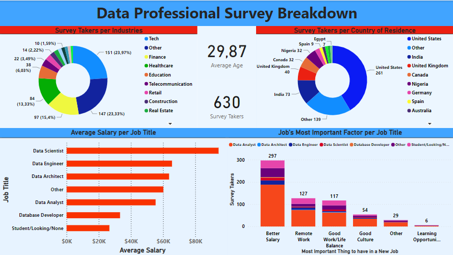
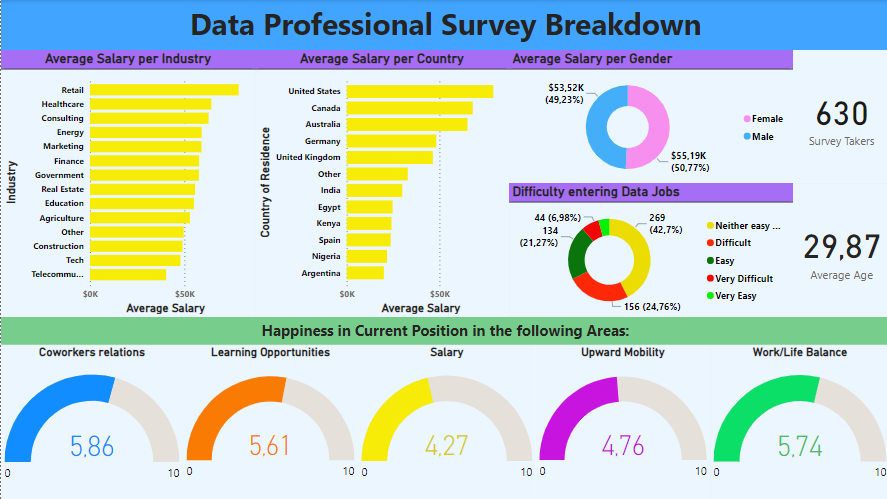

# Data Professionals Survey Power BI Project

The aim of this Power BI project was to analyze survey data from 630 data professionals made by [Alex The Analyst](https://www.youtube.com/watch?v=pixlHHe_lNQ&list=PLUaB-1hjhk8FE_XZ87vPPSfHqb6OcM0cF&index=42) in order to gain insights into their roles, salaries, satisfaction levels, preferences, and demographic information. The project aimed to expand the insights and the project complexity reached in the Tutorial by adding some Data Cleaning and transformation and by adding an extra page to the Power BI dashboard.

The dataset used in this project contains the following columns:

- "Unique ID": A unique identifier for each survey respondent.
- "Email": The email address of the survey respondent which were anonymized to preserve privacy
- "Date Taken(America/New_York)": The date when the survey was taken in the America/New_York timezone.
- "Time Taken (America/New_York)": The actual time when the survey was taken in the America/New_York timezone.
- "Time Spent": The duration it took for the survey respondent to complete the survey
- "Q1 - Which Title Best Fits your Current Role?": The current job title of the survey respondent, either Data Analyst, Data Architect, Data Engeneer, Data Scientist, Other, or Student/Looking/Noone
- "Q2 - Did you switch careers into Data?": Whether the survey respondent transitioned into a data-related career.
- "Q3 - Current Yearly Salary (in USD)": The annual salary of the survey respondent in a range format.
- "Q4 - What Industry do you work in?": The industry in which the survey respondent is currently employed.
- "Q5 - Favorite Programming Language": The preferred programming language of the survey respondent between C/C++, Java, Javascript, Python, R or other.
- "Q6 - How Happy are you in your Current Position with the following? (Salary)": The level of satisfaction with salary from 0 to 10.
- "Q6 - How Happy are you in your Current Position with the following? (Work/Life Balance)": The level of satisfaction with work-life balance from 0 to 10.
- "Q6 - How Happy are you in your Current Position with the following? (Coworkers)": The level of satisfaction with their coworkers from 0 to 10.
- "Q6 - How Happy are you in your Current Position with the following? (Management)": The level of satisfaction with the management from 0 to 10.
- "Q6 - How Happy are you in your Current Position with the following? (Upward Mobility)": The level of satisfaction with upward mobility from 0 to 10.
- "Q6 - How Happy are you in your Current Position with the following? (Learning New Things)": The level of satisfaction with learning new things from 0 to 10.
- "Q7 - How difficult was it for you to break into Data?": The level of difficulty in entering the data field.
- "Q8 - If you were to look for a new job today, what would be the most important thing to you?": The most important factor when considering a new job between Better Salary, Good Culture, Good Work/Life Balance, Remote Work or other.
- "Q9 - Male/Female?": The gender of the survey respondent.
- "Q10 - Current Age": The age of the survey respondent.
- "Q11 - Which Country do you live in?": The country of residence of the survey respondent, either Canada, USA, UK, India or Other.
- "Q12 - Highest Level of Education": The highest level of education completed by the survey respondent.
- "Q13 - Ethnicity": The ethnicity of the survey respondent.

In every "Other" answer it was also asked to specify in a text box the respondant actual answer.

There were also 5 more columns ("Browser", "OS", "City", "Country", "Referrer") but they were empty so they were discarded immediately.

## Implementation Details
The following steps were taken in the project:

- Data Cleaning: As mentioned before, all the "Other" answer contained also the specification of the alternative choosed by the respondent. Therefore, they had to be grouped in the same labels to address typos or different way to write the same thing. Certain columns were transformed to make them more granular by adding extra labels obtained from the "Other" category.
For example, in the Industry column it was added "Retail", "Consulting", "Marketing", etc. as they were common enough to deserve their own category. I tried to avoid making new categories for very small samples, e.g. in the Country of Residence column there were only 2 danish respondents so they were left them in the "Other" category instead of creating a new one, as the insigths obtained by such small sample would have not been very reliable. Similar transformations were made in the column of the Current Job Title and in the column of the most important factor when considering a new job.
Lastly, the values of the Average Salary column were transformed into actual averages by taking the mean value of the ratios that were provided in the survey as selectable answers. This was done to facilitate calculations

- Data Analysis: Various visualizations and calculations were performed using Power BI to gain insights into the survey data. Key areas of analysis included salary distribution, job satisfaction, country of origin, difficulty in entering the data field, and more.
        
- Dashboard Creation: A comprehensive dashboard was created using Power BI to present the analysis results in an interactive and visually appealing manner. The dashboard consisted of multiple charts to allow users to explore and filter the data based on their interests.

## Files

The project contains the following files:

`Data professional Survey.xlsx`: The Excel file containing the dataset.

`Data professional Survey.pbix`: The Power BI file with the dashboard containing all the charts.

`Dashboard1.png` and `Dashboard2.png`: Previews of the two pages od the dashboard.

## Conclusion

After analyzing the data, we obtained the following insights:

The majority of the respondents come from the US(261), India(73), UK(40) and Canada(32). Moreover, the industries they tend to work in are Tech(23.97%), Finance(15.4%), Healthcare(13.33%) and Education(6.03%)

Data Scientists are paid more than the other titles with an average salary of $94,423. However, it needs to be noted that this sample is made of only 26 survey takers, but if we filter by country, we can still see them on top of the chart in most of them. Unfortunately, this dataset is very imbalanced, as more than half of the respondents (381) are Data Analyst. They tend to have instead a lower salary of $55,297 on average. As expected, the lowest salary of $26,577 is associated with people that answered with "Student/Looking/Noone". 

Despite the high income overall, the most important factor when considering a new job seems to be Higher Salary(297), followed by Remote Work(127) and Good Work/Life Balance(117). Even most of the Data Scientist voted for a better salary.

The three industries with the highest average salary are Retail, Healthcare and Consulting while Telecommunication is the lowest with $40,295. Instead, the three countries with the highest average salary are the US, Canada and Australia while Argentina is the lowest with only $20,000. Moreover, only the threee country just mentioned have a salary over $50,000.

The average salary doesn't seem to be influenced by the gender as men and women have, respectivelly, an average salary of 53,521 and 55,191. This split appears in every country except Australia where men earn $74,583 against $36,500 for women.

The respondents are slightly satisfied with Coworker Relations, Learning Opportunities and Work/Life Balance. However, they are slightly unsatisfied with the upward mobility and their current salary as we saw before. This is expecially true for the Nigerian respondents as they have a satisfaction of only 1.58 out of 10. This is probably due to the fact they earn on average $21,734, second lowest salary per country, while the cost of life is higher compared to Argentina. The most satisfied are instead the German respondents with a value of 5.36.

Here, you can see a preview of the dashboard

